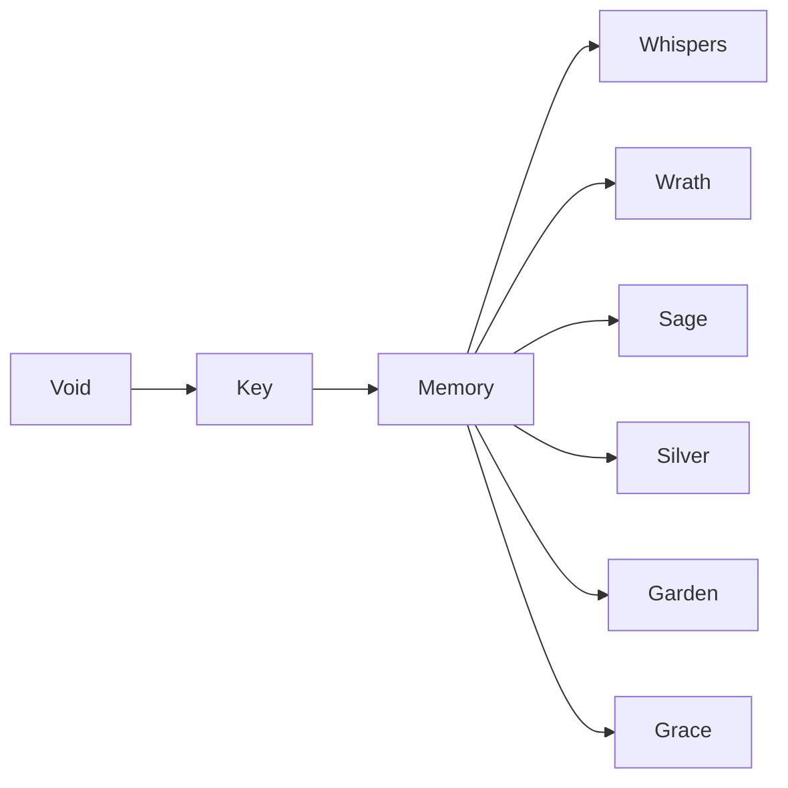

# Themodynamic Stark - Visual Preview

This document demonstrates how various Markdown elements appear in the Themodynamic Stark theme.

## Headers

# H1 - Memory.Grace (Purple) - Bold
## H2 - Memory.Grace (Purple) - Semibold
### H3 - Memory.Garden (Yellow) - Semibold
#### H4 - Memory.Garden (Yellow Darker) - Semibold
##### H5 - Memory.Silver (Blue) - Semibold
###### H6 - Memory.Silver (Blue Darker) - Semibold

## Text Styling

This is normal text in the default foreground color.

**This is bold text** in Memory.Garden (yellow).

*This is italic text* in Memory.Silver (blue).

**_This is bold italic text_** combining both styles.

~~This is strikethrough text.~~

## Links

[[Internal Link]] - Memory.Silver (blue)
[[Unresolved Link]] - Muted Memory.Silver
[External Link](https://example.com) - Memory.Wrath (orange)

## Code

Inline `code` appears in Memory.Sage (green) with a background.

```javascript
// Code block with syntax highlighting
function example() {
  const variable = "Memory.Silver";
  const number = 42; // Memory.Wrath (orange)
  return variable; // Memory.Sage (green)
}
```

```python
# Python example
def calculate(x, y):
    """Memory.Silver for strings"""
    result = x + y  # Memory.Wrath for numbers
    return result
```

## Lists

- Unordered list item
- Another item
  - Nested item
  - Another nested item

1. Ordered list item
2. Second item
   1. Nested ordered item
   2. Another nested item

## Task Lists

- [ ] Incomplete task
- [x] Completed task (Memory.Grace checkbox)
- [ ] Another incomplete task
  - [x] Nested completed task

## Blockquotes

> This is a blockquote with italic styling and a left border in Memory.Silver.
>
> Multiple lines in the blockquote maintain the same styling.

## Tags

#example-tag #memory-grace #character-themed

Tags appear in Memory.Grace (purple) with a background.

## Tables

| Header 1 | Header 2 | Header 3 |
|----------|----------|----------|
| Cell 1   | Cell 2   | Cell 3   |
| Cell 4   | Cell 5   | Cell 6   |
| Cell 7   | Cell 8   | Cell 9   |

Tables have alternating row colors for readability.

## Horizontal Rules

---

## Callouts (if using callout syntax)

> [!note]
> This is a note callout.

> [!warning]
> This is a warning callout in Memory.Wrath (orange).

> [!error]
> This is an error callout in Memory.Whispers (red).

> [!success]
> This is a success callout in Memory.Sage (green).

## Highlighting

==This text is highlighted== in Memory.Grace.

## Math (if using MathJax)

Inline math: $E = mc^2$

Block math:
$$
\int_{0}^{\infty} e^{-x^2} dx = \frac{\sqrt{\pi}}{2}
$$

## Footnotes

Here's a sentence with a footnote[^1].

[^1]: This is the footnote content.

## Images


## Mermaid Diagrams (if enabled)



## Color Reference

### Void Band (Backgrounds)
- Void 0: `#131114` - Deepest shadow
- Void 1: `#201d21` - Standard dark
- Void 2: `#2f2c30` - Lightest dark

### Key Band (Highlights)
- Key 0: `#e0ddd3` - Aged parchment
- Key 1: `#edebe4` - Standard paper
- Key 2: `#f7f6f2` - Brightest highlight

### Memory Band (Character Colors)

**Memory.Whispers** (Alice's favorite - Red):
- `#ad7676` → `#854a4a` → `#5c2828` → `#330f0f`

**Memory.Wrath** (Colt's eyes - Orange):
- `#e09970` → `#ad6c45` → `#7a4322` → `#47210b`

**Memory.Sage** (Alice's eyes - Green):
- `#bcd6b0` → `#92b282` → `#6d8f5b` → `#4a6b3a`

**Memory.Silver** (Silver's eyes - Blue):
- `#b4c6e0` → `#849ab8` → `#5a708f` → `#364a66`

**Memory.Garden** (Mary's hair - Yellow):
- `#f5efc9` → `#d1c997` → `#ada56c` → `#8a8148`

**Memory.Grace** (Colt's scarf - Purple):
- `#cc6aa2` → `#a3457a` → `#7a2656` → `#521035`

---

*"Color is rare. When it appears, it means something."*
